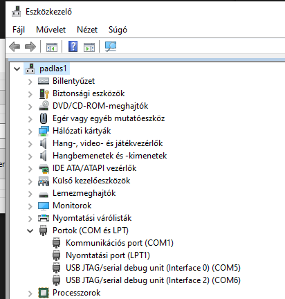

# Enki Hungrál – ESP32-C3 RGB LED vezérlő

## Tartalomjegyzék
- [Gombkezelés](#gombkezeles)
  - [Nyomástípusok](#nyomastipusok)
  - [Konfiguráció](#konfiguracio)
- [WiFi Funkcionalitás](#wififunc)
  - [AP adatok](#ap-adatok)
  - [WiFi engedélyezése](#wifibe)
  - [WiFi letiltása / leállítás](#wifiki)
- [Weblap](#weblap)
  - [Elérhető funkciók](#avalfunc)
  - [WebSocket protokoll (belső)](#websocket)
- [Alvási időzítő](#alvas)
- [Első letöltés](#elso-letoltes)

## Gombkezelés

### Nyomástípusok

1. **Hosszú Nyomás (ébresztés, ≥5 mp)**:
   - Mélyalvásból (deep sleep) ébreszti az eszközt.
   - Ha a gombot 5 másodpercnél korábban engedik el, az eszköz visszaalszik.
   - 5 mp után az eszköz aktív üzemmódba lép és bekapcsolja az aktív színt.

2. **Rövid Nyomás (0,5–1,0 mp, aktív üzemmódban)**:
   - Lépteti a színlistát: a következő elmentett színre vált.
   - Újraindítja az alvási időzítőt.
   - Az új aktív szín indexét elmenti a flash memóriába.

### Konfiguráció
A gombkezelés a `loop()` függvényben található. A nyomásidő határok (`500`–`1000` ms) és az ébresztési várakozás (`5000` ms) az `src/main.cpp` fájlban módosíthatók.

---

## WiFi Funkcionalitás

A `PIN_WIFIEN` (GPIO10) jumper az ESP32-C3 WiFi Access Point (AP) módjának kezelésére szolgál. **Az eszköz nem csatlakozik meglévő hálózathoz, hanem saját hozzáférési pontot hoz létre.**

### AP adatok
- **SSID:** `ENKILED` (jelszó nélküli, nyílt hálózat)
- **IP cím:** `192.168.99.9`
- **mDNS:** `enkiled.local`
- **Captive portal:** minden DNS kérés az AP IP-re irányítódik

### WiFi engedélyezése
- A jumper legyen zárt (`LOW`) **és** az eszköz mélyálomból, gombnyomással ébredjen fel.
- Ekkor az AP elindul és elérhető a weblap.

### WiFi letiltása / leállítás
- Ha a jumpert kihúzzák (felfutó él) és az AP legalább 4 perce fut (és nincs folyamatban OTA frissítés), az eszköz automatikusan újraindul WiFi nélkül.

---

## Weblap (`http://192.168.99.9` vagy `http://enkiled.local`)

A weblap WebSocket kapcsolaton keresztül kommunikál az eszközzel, valós idejű frissítéssel.

### Elérhető funkciók

| Funkció | Leírás |
|---|---|
| **Akkumulátor feszültsége** | Az aktuális akkufeszültség valós időben (V) |
| **Világítási idő** | Alvásig hátralévő idő beállítása (5–60 perc) |
| **Színlista** | Max. 25 szín: név, R, G, B (0–255), frekvencia (1–40000 Hz) |
| **Szín aktiválása** | Sorra kattintva azonnal az adott színre vált az LED |
| **Szín hozzáadása / törlése** | `+` / `−` gombok a listában |
| **Beállítások mentése** | Az összes szín és az alvási idő flash memóriába mentése |
| **Rendszerfrissítés (OTA)** | Átirányít a `/update` oldalra, ahol firmware frissíthető |

### WebSocket protokoll (belső)
- `SET:<idx>:<r>:<g>:<b>:<freq>` → PWM azonnali frissítés
- `NAME:<idx>:<név>` → Szín nevének módosítása
- `SLEEP:<perc>` → Alvási idő beállítása
- `SAVE` → Minden adat mentése flash-be
- `ADD` → Új szín hozzáadása
- `DEL:<idx>` → Szín törlése

## Alvási időzítő

Az eszköz az utolsó interakció (indulás, szín léptető gomb, mentés) után `sleepMinutes` perccel automatikusan mélyálomba (deep sleep) lép:
1. LED-ek kikapcsolnak.
2. Buzzer 2 másodpercig szól.
3. Az eszköz deep sleep módba lép, GPIO3 (nyomógomb) lefutó élre ébred.

## Első letöltés

Legelső firmware letöltésnél USB-C adatkábellel csatlakoztatni kell az ESP32-C3-SuperMini-t PC USB porthoz. Ilyenkor az eszközkezelőben megjelenik két `USB JTAG/serial debug unit` a Portok között. Ekkor BOOT gomb (USB csatlakozó balra, az alsó gomb) nyomvatartása alatt az RST gombot (felső gomb) meg kell nyomni, elengedni majd a BOOT-ot is elengedni. Flashelhető állapotba kerül az ESP32. Az eszközkezelőben megnézzük az Interface 0 COM port számát. Ezt használva a letöltésnél az sikeres lesz. Akár Platform.IO, akár direkt esptools-szal működik.

